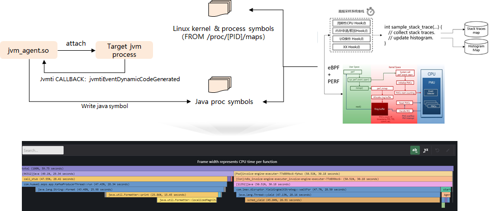
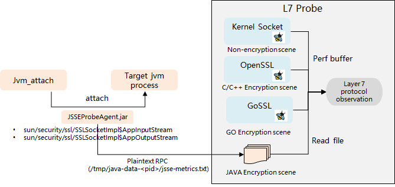

# gala-gopher


## 什么是gala-gopher

gala-gopher是gala项目内负责数据采集的组件，其为gala项目提供Metrics、Event、Perf等数据，便于gala项目完成系统拓扑的绘制和故障根因的定位。
gala-gopher是一款结合eBPF、java agent等非侵入可观测技术的观测平台，探针是gala-gopher用于观测和采集数据的主要工具，通过探针式架构gala-gopher可以轻松实现增加、减少探针。

## 观测范围

### 系统性能

系统层资源可能会影响应用性能，使用gala-gopher将提供Node、Container、Device等维度的系统性能观测能力。包括：

- CPU性能：参见[CPU性能指标](https://gitee.com/openeuler/gala-docs/blob/master/gopher_tech.md#cpu)，将提供CPU粒度的实时性能指标。
- 内存性能：参见[内存性能指标](https://gitee.com/openeuler/gala-docs/blob/master/gopher_tech.md#%E5%86%85%E5%AD%98)，参见系统内存、buffer、cache、dentry等多种资源实时指标。
- 网络性能：参见[网卡性能指标](https://gitee.com/openeuler/gala-docs/blob/master/gopher_tech.md#%E7%BD%91%E5%8D%A1%E7%BB%9F%E8%AE%A1)，[协议栈性能](https://gitee.com/openeuler/gala-docs/blob/master/gopher_tech.md#%E5%8D%8F%E8%AE%AE%E6%A0%88%E7%BB%9F%E8%AE%A1)统计，包括主机内TCP连接数量、接收报文数量、网卡收发字节数、丢包数等。
- I/O性能：参见[Block性能指标](https://gitee.com/openeuler/gala-docs/blob/master/gopher_tech.md#block%E7%BB%9F%E8%AE%A1)，[磁盘指标](https://gitee.com/openeuler/gala-docs/blob/master/gopher_tech.md#%E7%A3%81%E7%9B%98%E7%BB%9F%E8%AE%A1)，包括磁盘读写速率、使用率、吞吐量等指标，以及block层驱动、设备的时延、错误统计。
- 容器性能：参见[容器性能指标](https://gitee.com/openeuler/gala-docs/blob/master/gopher_tech.md#%E5%AE%B9%E5%99%A8%E6%80%A7%E8%83%BD)，提供容器维度CPU、内存、I/O、网络多维度可观测数据。

### 网络监控

通过网络监控能力，可以轻松获取如下信息：

- 集群内微服务间TCP流量拓扑：提供进程粒度[TCP流量监控](https://gitee.com/openeuler/gala-docs/blob/master/gopher_tech.md#tcp%E6%8C%87%E6%A0%87)，结合[gala-spider](https://gitee.com/openeuler/gala-spider)可以轻松获取集群内微服务间TCP拓扑。
- DNS访问监控：参考[DNS访问监控](https://gitee.com/openeuler/gala-docs/blob/master/gopher_tech.md#dns%E6%8C%87%E6%A0%87)，提供进程内DNS域名访问的平均、最大时延、错误率。
- TCP/IP监控：提供TCP连接粒度的[异常监控](https://gitee.com/openeuler/gala-docs/blob/master/gopher_tech.md#tcp%E6%8C%87%E6%A0%87)，包括重传、丢包、TCP oom、收发RST等异常指标；提供[Socket异常监控](https://gitee.com/openeuler/gala-docs/blob/master/gopher_tech.md#tcp%E6%8C%87%E6%A0%87)，包括listen队列溢出、syn队列溢出、建链失败次数等统计信息。

### 应用（微服务）访问性能监控

云原生场景会部署大量微服务，微服务之间访问性能的波动会直接影响整体业务效果，使用gala-gopher可以轻松了解每个微服务（或者POD）的[访问时延、吞吐量、错误率性能](https://gitee.com/openeuler/gala-docs/blob/master/gopher_tech.md#%E5%BA%94%E7%94%A8%E6%80%A7%E8%83%BD)。

其支持微服务之间的访问协议包括：HTTP 1.X，PGSQL，Redis，#DNS，#HTTP2.0，#Dubbo，#MySQL，#Kafka（#表示规划中）；

支持加密场景：C/C++语言（OpenSSL 1.1.0/1.1.1）; GO语言（GoTLS）；Java语言（JSSE类库）

### 应用详细监控

应用性能经常受系统资源性能影响，gala-gopher可以提供应用视角精细化（进程粒度）的系统性能观测能力，涉及网络、I/O、内存、调度等多个方面。

- [TCP性能](https://gitee.com/openeuler/gala-docs/blob/master/gopher_tech.md#tcp%E6%8C%87%E6%A0%87)：提供TCP窗口、RTT、SRTT、reordering、ato等性能指标；
- [I/O性能](https://gitee.com/openeuler/gala-docs/blob/master/gopher_tech.md#%E5%BA%94%E7%94%A8io)：提供进程维度的 I/O操作字节数统计、FD资源占用统计、文件系统（vfs/ext4/overlay/tmpfs）层时延统计，大小I/O操作数量统计、BIO时延、错误统计（虚拟化QEMU进程有意义）等；
- [内存](https://gitee.com/openeuler/gala-docs/blob/master/gopher_tech.md#%E5%BA%94%E7%94%A8%E5%86%85%E5%AD%98-1)：提供进程维度的pagefault、swap区、脏页、虚拟内存、物理内存等统计。
- [JVM监控](https://gitee.com/openeuler/gala-docs/blob/master/gopher_tech.md#%E5%BA%94%E7%94%A8jvm)：提供jvm线程、java类加载、jvm内存、jvm buffer、gc次数/花费时间等统计。
- [DNS监控](https://gitee.com/openeuler/gala-docs/blob/master/gopher_tech.md#dns%E6%8C%87%E6%A0%87)：基于Glibc接口（gethostbyname/getaddrinfo等）获取应用DNS访问性能。

### 性能Profiling

性能火焰图是常用的性能问题诊断工具，常见的性能火焰图工具（perf、async-profier）存在底噪大、精细化不够、多语言能力不够等问题。

gala-gopher提供持续、低底噪、多实例形式的性能Profiling能力，覆盖C/C++、Go、Java（最佳效果时，推荐加上-XX:+PreserveFramePointer启动参数）语言。


使用方法参考[这里](https://gitee.com/openeuler/gala-docs#qa)。

### kafka监控

kafka通常作为分布式应用场景中的消息中心，现有监控工具对kafka topic的观测、跟踪缺乏有效手段，gala-gopher针对此问题，提供自动化的kafka监控能力。提供能力如下：

- [Topic流监控](https://gitee.com/openeuler/gala-docs/blob/master/gopher_tech.md#topic%E6%B5%81%E7%9B%91%E6%8E%A7)：提供topic 生产者、消费者的IP、Port信息，结合gala-spider，可以绘制出topic流视图。

- [Topic性能](https://gitee.com/openeuler/gala-docs/blob/master/gopher_tech.md#topic%E6%80%A7%E8%83%BD%E7%9B%91%E6%8E%A7)：提供topic维度的吞吐量性能。

  约束：不支持加密场景。

### nginx/haproxy监控

nginx/haproxy通常作为云原生应用之间的负载均衡，网络流量经过负载均衡之后，现有监控工具无法有效观测云原生应用之间的真实流量路径。gala-gopher为此提供面向负载均衡的网络流量观测能力：

- [Nginx负载分担监控](https://gitee.com/openeuler/gala-docs/blob/master/gopher_tech.md#nginx-%E8%B4%9F%E8%BD%BD%E5%88%86%E6%8B%85%E7%9B%91%E6%8E%A7)：提供nginx负载分担会话观测能力，基于负载分担会话，结合gala-spider可以绘制出云原生应用之间真实流量路径。
- [Haproxy负载分担监控](https://gitee.com/openeuler/gala-docs/blob/master/gopher_tech.md#haproxy%E8%B4%9F%E8%BD%BD%E5%88%86%E6%8B%85%E7%9B%91%E6%8E%A7)：提供haproxy负载分担会话观测能力，基于负载分担会话，结合gala-spider可以绘制出云原生应用之间真实流量路径。


### Redis/PostgreSQL监控

Redis/PostgreSQL常用于为应用提供数据存储服务，现有性能监控工具（拨测、打点）存在失真、误差等问题，gala-gopher针对redis/PostgreSQL应用，提供非侵入的性能观测能力。除此以外，这类应用性能经常受网络、I/O影响，gala-gopher提供针对这些应用的网络、I/O监控能力。

- [Redis性能监控](https://gitee.com/openeuler/gala-docs/blob/master/gopher_tech.md#redis%E6%80%A7%E8%83%BD%E7%9B%91%E6%8E%A7)：提供精细化的（具体到某个TCP）redis时延监控能力。（注意不支持加密场景）
- [PostgreSQL性能监控](https://gitee.com/openeuler/gala-docs/blob/master/gopher_tech.md#postgresql%E6%80%A7%E8%83%BD%E7%9B%91%E6%8E%A7)：提供精细化的（具体到某个TCP）Postgre时延监控能力。

备注：与[应用访问性能监控](./README.md#%E5%BA%94%E7%94%A8%E5%BE%AE%E6%9C%8D%E5%8A%A1%E8%AE%BF%E9%97%AE%E6%80%A7%E8%83%BD%E7%9B%91%E6%8E%A7)的区别在于，该观测精度略低，但是其底噪更低。

## 软件架构

gala-gopher集成了常用的native探针以及知名中间件探针；gala-gopher有良好的扩展性，能方便的集成各种类型的探针程序，发挥社区的力量丰富探针框架的能力；gala-gopher中的几个主要部件：

- gala-gopher框架

  gala-gopher的基础框架，负责配置文件解析、native探针/extend探针的管理、探针数据收集管理、探针数据上报对接、集成测试等；

- native探针

  原生探针，主要是基于linux的proc文件系统收集的系统观测指标；

- extend探针

  支持shell/java/python/c等不同语言的第三方探针程序，仅需满足轻量的数据上报格式即可集成到gala-gopher框架中；方便满足各种应用场景下的观测诉求；目前已实现知名中间件程序的探针观测及指标上报，如：lvs、nginx、haproxy、dnsmasq、dnsbind、kafka、rabbitmq等；

- 部署配置文件

  gala-gopher启动配置文件，可自定义基础框架行为，比如日志级别、指定数据上报的对接服务信息（kafka/prometheus等）。

## 安装指南

### 快速安装

- [RPM方式](#rpm方式)：适用于无容器的单机观测场景，支持OS版本：openEuler 22.03 LTS SP1及以上。
- [单机容器方式](#单机容器方式)：适用于支持容器化的单机观测场景，支持OS版本：openEuler全系LTS版本（推荐openEuler 22.03 LTS SP1及以上）。
- [k8s集群方式](#k8s-集群方式)：适用于观测云原生集群多节点场景，支持OS版本：openEuler全系LTS版本（推荐openEuler 22.03 LTS SP1及以上）。

#### RPM方式

1. 获取rpm包

   从[发行版仓库](https://gitee.com/openeuler/gala-gopher/releases)选择合适的版本（推荐最新版），下载对应架构的rpm包。

2. rpm安装

   配置OS版本配套的openEuler repo源，至少包含everything、update、EPOL三个目录（具体配置方法可参考openEuler社区文档《管理员指南》），然后通过如下命令进行安装（以2.0.0-dev发行版x86_64架构为例）：

   ```
   yum install gala-gopher-2.0.0-1.oe2203sp1.x86_64.rpm
   ```

3. 启动服务

   通过 systemd 启动后台服务：

   ```
   systemctl start gala-gopher.service
   ```

#### 单机容器方式

1. 获取官方容器镜像

   ```
   # x86_64架构
   docker pull hub.oepkgs.net/a-ops/gala-gopher-x86_64

   # aarch64架构
   docker pull hub.oepkgs.net/a-ops/gala-gopher-aarch64
   ```

   *注：如果拉取镜像的过程中出现"X509: certificate signed by unknown authority"错误，则需要将"hub.oepkgs.net"加入到/etc/docker/daemon.json（文件不存在时需要手动创建）中的"insecure-registries"项后重启docker服务再重试。*

2. 准备BTF文件

   gala-gopher的跨版本兼容（CO-RE）特性依赖内核BTF文件，在openEuler某些早期版本内核未自带BTF文件，此时需要手动准备。

   用户可以查看系统上/sys/kernel/btf/vmlinux是否存在，如果存在，可以直接跳过本步骤。

   在[openEuler btf 归档仓库](https://gitee.com/openeuler/btfhub-archive)进入对应OS版本和架构目录，下载与内核版本（执行uname -r命令获取）完全一致的btf压缩文件，例如4.19.90-2012.4.0.0053.oe1.x86_64.btf.tar.xz，通过如下命令解压到/home目录：

   ```
   tar -xf 4.19.90-2012.4.0.0053.oe1.x86_64.btf.tar.xz -C /home/
   ```

   *注：对于非openEuler操作系统，请寻求OSV厂商支持，或者自行制作BTF文件。*

3. 创建并运行容器

   以x86_64架构为例，aarch64只需要替换最后的镜像名即可：

   1）系统存在/sys/kernel/btf/vmlinux文件时：

   ```
   docker run -d --name gala-gopher --privileged --pid=host --network=host \
   -v /:/host -v /etc/localtime:/etc/localtime:ro -v /sys:/sys \
   -v /usr/lib/debug:/usr/lib/debug -v /var/lib/docker:/var/lib/docker \
   -e GOPHER_HOST_PATH=/host \
   hub.oepkgs.net/a-ops/gala-gopher-x86_64
   ```

   2）系统不存在/sys/kernel/btf/vmlinux文件时，需要将步骤2中准备的btf文件映射到容器中：

   ```
   docker run -d --name gala-gopher --privileged --pid=host --network=host \
   -v /:/host -v /etc/localtime:/etc/localtime:ro -v /sys:/sys \
   -v /usr/lib/debug:/usr/lib/debug -v /var/lib/docker:/var/lib/docker \
   -v /home/4.19.90-2012.4.0.0053.oe1.x86_64.btf:/opt/gala-gopher/btf/4.19.90-2012.4.0.0053.oe1.x86_64.btf \
   -e GOPHER_HOST_PATH=/host \
   hub.oepkgs.net/a-ops/gala-gopher-x86_64
   ```

#### K8S 集群方式

[k8s环境部署指导](./k8s/README.md)

#### 安装验证

完成安装后，可执行如下命令进行验证，如果命令执行未报错，则表示安装已成功。

```
curl http://localhost:8888
```

### 自定义配置

#### 框架配置

gala-gopher启动时框架的行为由配置文件控制，具体见[配置文件说明](./doc/conf_introduction.md)。

在容器/k8s场景下，用户可在部署gala-gopher通过如下参数修改部分配置（不指定参数时则保持默认配置）：

| 变量名                        | 变量作用                                                     | 配置值说明                                                   |
| ----------------------------- | ------------------------------------------------------------ | ------------------------------------------------------------ |
| GOPHER_LOG_LEVEL              | 控制gala-gopher日志输出级别                                  | 可配置如下值：debug/info/warn/error                          |
| GOPHER_EVENT_CHANNEL          | gala-gopher亚健康巡检异常事件输出方式                        | kafka：通过kafka上报（默认） logs：输出至本地日志            |
| GOPHER_META_CHANNEL           | gala-gopher观测对象元数据metadata输出方式                    | kafka：通过kafka上报（默认） logs：输出至本地日志            |
| GOPHER_KAKFA_SERVER           | gala-gopher上报亚健康巡检异常事件、观测对象元数据metadata的kafka服务端IP地址 | GOPHER_EVENT_CHANNEL和GOPHER_META_CHANNEL都设为logs时可设置为空，否则需要设置为有效的kafka服务端IP地址，例如1.2.3.4（IP地址中支持指定端口号，若未指定则使用默认端口号9092） |
| GOPHER_METRIC_ADDR            | gala-gopher作为prometheus exporter输出指标数据的监听地址     | 建议配置本机有效的网卡IP，默认为0.0.0.0，即全IP监听          |
| GOPHER_METRIC_PORT            | gala-gopher作为prometheus exporter输出指标数据的监听端口     | 配置有效且未被其他程序占用的端口号，默认为8888               |
| GOPHER_REST_ADDR              | 动态配置RESTful API的监听地址                                | 建议配置本机有效的网卡IP，默认为0.0.0.0，即全IP监听          |
| GOPHER_REST_PORT              | 动态配置RESTful API端口号                                    | 配置有效且未被其他程序占用的端口号，默认为9999               |
| GOPHER_REST_AUTH              | 控制动态配置RESTful接口是否开启https以及证书鉴权             | no：不开启（默认） yes：开启                                 |
| GOPHER_REST_PRIVATE_KEY       | 动态配置RESTful API开启https的私钥文件路径                   | GOPHER_REST_AUTH为yes时必配，路径为绝对路径                  |
| GOPHER_REST_CERT              | 动态配置RESTful API开启https的证书文件路径                   | GOPHER_REST_AUTH为yes时必配，路径为绝对路径                  |
| GOPHER_REST_CAFILE            | 动态配置RESTful API开启鉴权的CA证书文件路径                  | GOPHER_REST_AUTH为yes时必配，路径为绝对路径                  |
| GOPHER_METRIC_LOGS_TOTAL_SIZE | metrics指标数据日志文件总大小的上限，单位为MB                | 需为正整数，默认为100                                        |

#### 探针配置与启动

默认情况下，gala-gopher启动后不会运行任何探针，用户需要根据实际需求通过RestFul API启动探针，并配置其观测范围、运行参数等。

具体操作指导参考[探针动态配置接口说明](./config/gala-gopher支持动态配置接口设计_v0.3.md)。

#### 配置默认启动探针

为了防止重启gala-gopher服务或者容器时用户需要重新配置与启动探针，gala-gopher提供默认探针配置文件供用户固化探针配置。该文件安装在/etc/gala-gopher/probes.init，配置格式为：**[采集特性] [配置的json语句]**，每个探针一行，最多支持配置20行，多余配置会被忽略，例如：

```
tcp {"cmd":{"probe":["tcp_rtt","tcp_windows","tcp_abnormal"]},"snoopers":{"proc_name":[{"comm":"java","cmdline":""}]},"params":{"report_event":1},"state":"running"}
baseinfo {"cmd":{"probe":["cpu","fs","host"]},"state":"running"}
```

在容器/k8s场景下，用户可在部署gala-gopher通过GOPHER_PROBES_INIT参数来实现该功能（不指定该参数时则保持默认不运行任何探针），例如：

```
docker run -d --name gala-gopher --privileged --pid=host --network=host \
-v /:/host -v /etc/localtime:/etc/localtime:ro -v /sys:/sys \
-v /usr/lib/debug:/usr/lib/debug -v /var/lib/docker:/var/lib/docker \
-e GOPHER_HOST_PATH=/host \
-e GOPHER_PROBES_INIT='
baseinfo {"cmd":{"probe":["cpu","fs","host"]},"state":"running"}
tcp {"cmd":{"probe":["tcp_rtt"]},"snoopers":{"proc_name":[{"comm":"java"}]},"state":"running"}
' \
hub.oepkgs.net/a-ops/gala-gopher-x86_64
```

### 数据获取与集成

[系统集成API及方式](./doc/api_doc.md)

### 规格与约束

[规格与约束](./doc/constraints_introduction.md)

## 如何贡献

### 基于源码构建

#### **仅编译二进制**

**构建环境要求**：openEuler-22.03-LTS-SP1及以上，并配置OS版本配套的openEuler repo源，至少包含everything、update、EPOL三个目录（具体配置方法可参考openEuler社区文档《管理员指南》）。

下载仓库源码到本地，确认切换到master分支，然后在源码的[build目录](./build)下执行以下构建动作：

1. 安装构建依赖包

   该步骤会检查安装架构感知框架所有的编译依赖包，涉及三方探针编译、运行的依赖包会在编译构建中检查安装。

   ```
   # sh build.sh --check
   ```

2. 构建

   ```
   # sh build.sh --clean

   # sh build.sh --release     # RELEASE模式
   # 或者
   # sh build.sh --debug       # DEBUG模式
   ```

   注：DEBUG模式与RELEASE模式在功能上没有差别，DEBUG模式框架测和探针支持debug打印，便于本地调试与问题定位。

3. 安装

   ```
   # sh install.sh
   ```

4. 运行

   ```
   # gala-gopher
   ```

#### 构建rpm包

**构建环境要求**：openEuler-22.03-LTS-SP1及以上，并配置OS版本配套的openEuler repo源，至少包含everything、update、EPOL三个目录（具体配置方法可参考openEuler社区文档《管理员指南》）。

下载仓库源码到本地，确认切换到master分支，取出源码根目录下的[gala-gopher.spec](./gala-gopher.spec)后执行如下构建动作：

1. 安装rpm-build以及构建依赖包（参照编译二进制）

   ```
   # yum install rpm-build
   # sh build.sh --check
   ```

2. 生成源码压缩包并将其放入/root/rpmbuild/SOURCES目录下

   ```
   # cp -rf gala-gopher gala-gopher-2.0.0
   # tar czf gala-gopher-2.0.0.tar.gz gala-gopher-2.0.0
   # mkdir -p /root/rpmbuild/SOURCES
   # mv gala-gopher-2.0.0.tar.gz  /root/rpmbuild/SOURCES
   ```

3. 构建rpm包

   ```
   rpmbuild -ba gala-gopher.spec
   ```

等待构建完成后，rpm包文件被存放在/root/rpmbuild/RPMS/下对应架构目录内，示例如下：

    /root/rpmbuild/RPMS/x86_64/gala-gopher-2.0.0-1.x86_64.rpm
#### 构建容器镜像

1. 获取如下文件，放在同一目录下：

   - gala-gopher的rpm包：从[发行版仓库](https://gitee.com/openeuler/gala-gopher/releases)选择下载或者基于源码自行构建；

   - Dockerfile：从[build目录](./build)下载对应架构文件；
   - entrypoint.sh: 从[build目录](./build)下载

 2. 在目录中执行如下命令构建出容器镜像（以x86_64为例）：

    ```
    # docker build -f Dockerfile_x86_64 -t gala-gopher:2.0.0 .
    ```

	3. 保存/导入容器镜像

    生成容器镜像后可以通过save命令将镜像保存为tar文件:

    ```
    # docker save -o gala-gopher-2.0.0.tar gala-gopher:2.0.0
    ```

    其他宿主机可以通过load命令导入容器镜像：

    ```
    # docker load gala-gopher-2.0.0.tar
    ```

### 探针开发

[探针开发指南](./doc/how_to_add_probe.md)

## Q&A

### eBPF如何更好的运行在java场景

#### 场景1：持续性能Profiling

gala-gopher提供持续性能Profiling可以持续监控应用的OnCPU、OffCPU、Memory Alloc等性能。监控应用程序使用了eBPF周期性或事件触发式以持续收集应用堆栈信息。

通过java agent获取java函数符号表，eBPF获取堆栈信息，两者结合完成java场景的持续profiling。



#### 场景2：微服务访问性能监控

gala-gopher提供的微服务访问性能监控可以非侵入、多语言的完成L7层流量性能监控能力。在java场景中，java应用会使用JSSE类库进行加密通信，eBPF在内核层获取到L7层流量是加密态，无法完成解析以及性能监控。通过java agent字节码注入技术，将JSSEProbeAgent.jar attach至目标jvm进程完成明文RPC消息的获取，通过临时文件读入L7。



### 如何解决跨版本兼容性问题

参考[这里](./doc/compatible.md)。

## 路线图

### 巡检能力

| 特性                             | 发布时间 | 发布版本                             |
| -------------------------------- | -------- | ------------------------------------ |
| TCP异常巡检                      | 22.12    | openEuler 22.03 SP1                  |
| Socket异常巡检                   | 22.12    | openEuler 22.03 SP1                  |
| 系统调用异常巡检                 | 22.12    | openEuler 22.03 SP1                  |
| 进程I/O异常巡检                  | 22.12    | openEuler 22.03 SP1                  |
| Block I/O异常巡检                | 22.12    | openEuler 22.03 SP1                  |
| 资源泄漏异常巡检                 | 22.12    | openEuler 22.03 SP1                  |
| 硬件（磁盘/网卡/内存）故障巡检   | 23.09    | openEuler 22.03 SP1, openEuler 23.09 |
| JVM异常巡检                      | 23.09    | openEuler 22.03 SP1, openEuler 23.09 |
| 主机网络栈（包括虚拟化）丢包巡检 | 23.09    | openEuler 22.03 SP1, openEuler 23.09 |

### 可观测性

| 特性                                                         | 发布时间 | 发布版本                             |
| ------------------------------------------------------------ | -------- | ------------------------------------ |
| 进程级TCP观测能力                                            | 22.12    | openEuler 22.03 SP1                  |
| 进程级Socket观测能力                                         | 22.12    | openEuler 22.03 SP1                  |
| 分布式存储全栈I/O观测能力                                    | 22.12    | openEuler 22.03 SP1                  |
| 虚拟化存储I/O观测能力                                        | 22.12    | openEuler 22.03 SP1                  |
| Block I/O观测能力                                            | 22.12    | openEuler 22.03 SP1                  |
| 容器运行观测能力                                             | 22.12    | openEuler 22.03 SP1                  |
| Redis性能观测能力                                            | 22.12    | openEuler 22.03 SP1                  |
| PG性能观测能力                                               | 22.12    | openEuler 22.03 SP1                  |
| Nginx会话观测能力                                            | 22.12    | openEuler 22.03 SP1                  |
| Haproxy会话观测能力                                          | 22.12    | openEuler 22.03 SP1                  |
| Kafka会话观测能力                                            | 22.12    | openEuler 22.03 SP1                  |
| JVM性能观测能力                                              | 23.06    | openEuler 22.03 SP1, openEuler 23.09 |
| L7协议观测能力（HTTP1.X/MySQL/PGSQL/Redis/Kafka）            | 23.09    | openEuler 22.03 SP1, openEuler 23.09 |
| L7协议观测能力（HTTP1.X/MySQL/PGSQL/Redis/Kafka/MongoDB/DNS/RocketMQ） | 24.03    | openEuler 22.03 SP3，openEuler 24.03 |
| 通用应用性能观测能力                                         | 24.03    | openEuler 24.03                      |
| 全链路协议跟踪能力                                           | 24.09    | openEuler 24.09                      |

### 性能profiling

| 特性                                    | 发布时间 | 发布版本                             |
| --------------------------------------- | -------- | ------------------------------------ |
| 系统性能Profiling（OnCPU、Mem）         | 23.03    | openEuler 23.09                      |
| 系统性能Profiling（OnCPU、Mem、OffCPU） | 23.04    | openEuler 22.03 SP1, openEuler 23.09 |
| 线程级性能Profiling（java、C）          | 23.06    | openEuler 22.03 SP1, openEuler 23.09 |

### 版本兼容性

| 特性                        | 发布时间 | 发布版本                             |
| --------------------------- | -------- | ------------------------------------ |
| 支持内核Release版本跨度兼容 | 23.12    | openEuler 22.03 SP3, openEuler 24.03 |
| 支持内核大版本跨度兼容      | 24.09    | openEuler 24.09                      |
|                             |          |                                      |

### 可编程&扩展能力

| 特性                           | 发布时间 | 发布版本            |
| ------------------------------ | -------- | ------------------- |
| 非侵入集成第三方探针           | 22.12    | openEuler 22.03 SP1 |
| 非侵入集成第三方eBPF源码       | 24.03    | openEuler 23.09     |
| 大语言驱动自动生成eBPF观测探针 | 24.09    | openEuler 24.09     |


### 部署&集成能力

| 特性                             | 发布时间 | 发布版本                             |
| -------------------------------- | -------- | ------------------------------------ |
| 支持Prometheus exporter对接      | 22.12    | openEuler 22.03 SP1                  |
| 支持日志文件形式对接             | 22.12    | openEuler 22.03 SP1                  |
| 支持kafka client形式对接         | 22.12    | openEuler 22.03 SP1                  |
| 支持REST接口动态变更探针监控能力 | 23.06    | openEuler 22.03 SP1, openEuler 23.09 |

  ```

  ```
