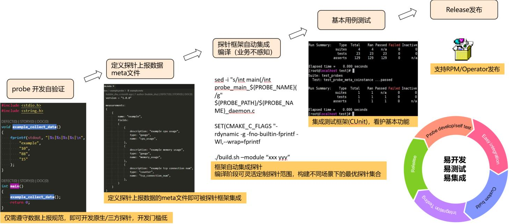

# gala-gopher

### 介绍
gala-gopher一款基于eBPF技术的探针框架，通过协同各种内核观测工具（包括CPU、网络、I/O、内存等）实现将操作系统运行状态白盒化呈现，并通过扩展能力提供系统性能瓶颈分析，应用性能劣化故障诊断等特性。

### 软件架构
gala-gopher集成了常用的native探针以及知名中间件探针；gala-gopher有良好的扩展性，能方便的集成各种类型的探针程序，发挥社区的力量丰富探针框架的能力；gala-gopher中的几个主要部件：

- gala-gopher框架

  gala-gopher的基础框架，负责配置文件解析、native探针/extend探针的管理、探针数据收集管理、探针数据上报对接、集成测试等；

- native探针

  原生探针，主要是基于linux的proc文件系统收集的系统观测指标；

- extend探针

  支持shell/java/python/c等不同语言的第三方探针程序，仅需满足轻量的数据上报格式即可集成到gala-gopher框架中；方便满足各种应用场景下的观测诉求；目前已实现知名中间件程序的探针观测及指标上报，如：lvs、nginx、haproxy、dnsmasq、dnsbind、kafka、rabbitmq等；

- 部署配置文件

  gala-gopher启动配置文件，可自定义具体使能的探针、指定数据上报的对接服务信息（kafka/promecheus等）

### 快速开始

#### 基于rpm包安装运行

- yum源配置

  gala-gopher目前仅在openEuler 21.09和openEuler 22.09发布，可以直接在发布版本的repo源获取rpm包；对于其他发布版本我们提供了OBS链接可以获取rpm包：

  ```basic
  openEuler-20.03-LTS : https://117.78.1.88/package/show/home:zpublic:branches:openEuler:20.03:LTS:SP1/gala-gopher-20.03lts
  openEuler-20.03-LTS-SP1 : https://117.78.1.88/package/show/home:zpublic:branches:openEuler:20.03:LTS:SP1/gala-gopher
  openEuler-22.03-LTS : https://117.78.1.88/package/show/home:zpublic:branches:openEuler:22.03:LTS:Next/gala-gopher
  EulerOS-V2R9C00 : https://117.78.1.88/package/show/home:zpublic:branches:openEuler:20.03:LTS:SP1/gala-gopher-v2r9
  ```

- rpm安装

  ```bash
  # yum install gala-gopher
  ```

- 运行

  直接运行命令，

  ```bash
  # gala-gopher
  ```

  或者通过 systemd 启动，

  ```bash
  # systemctl start gala-gopher.service
  ```

#### 基于容器镜像安装运行

- 准备工作

  获取gala-gopher的rpm包，获取方式详见第一小节[基于rpm包安装运行](#基于rpm包安装运行)。

- 生成容器镜像

  用于生成容器镜像的Dockerfile文件归档在[build目录](./build)，生成方法详见[如何生成gala-gopher容器镜像](doc/how_to_build_docker_image.md)。

- 运行容器

  ```shell
  # docker run -d --name xxx -p 8888:8888 --privileged -v /lib/modules:/lib/modules:ro -v /usr/src:/usr/src:ro -v /boot:/boot:ro -v /sys/kernel/debug:/sys/kernel/debug -v /sys/fs/bpf:/sys/fs/bpf -v /root/gopher_user_conf:/gala-gopher/user_conf/ -v /etc/machine-id:/etc/machine-id -v /etc/localtime:/etc/localtime:ro --pid=host gala-gopher:0.0.1
  ```

#### 基于源码编译、安装、运行

​	建议在最低openEuler-20.03-LTS-SP1的环境执行编译动作，这是因为gala-gopher中ebpf探针编译依赖clang和llvm，大多数的bpf功能需要clang 10或者更高版本才可以正常工作，而20.03-SP1以下的发布版本中clang版本较低(低于10)。

如下编译安装脚本在[build目录](./build)。

- 安装依赖

  该步骤会检查安装架构感知框架所有的依赖包，涉及三方探针编译、运行的依赖包会在编译构建中检查安装。

  ```bash
  # sh build.sh --check
  ```

- 构建

  ```bash
  # sh build.sh --clean
  # sh build.sh --release     # RELEASE模式
  # 或者
  # sh build.sh --debug       # DEBUG模式
  ```

  注：在编译过程中出现如下信息，表示bpf探针编译需要的vmlinux.h文件缺失；

  

  ​	vmlinux.h文件包含了系统运行Linux内核源码中使用的所有类型定义，可以利用bpftool工具生成；我们已经预生成了几个openEuler发布版本的vmlinux.h文件在`src\probes\extends\ebpf.probe\src\include`目录，请根据内核版本、CPU架构选择相应的文件，并手动软链接到vmlinux.h；例如：

  ```shell
  [root@master ~]# uname -r
  4.19.90-2012.5.0.0054.oe1.x86_64
  [root@master ~]# ln -s linux_4.19.90-2012.5.0.0053.oe1.x86_64.h vmlinux.h
  ```

  生成vmlinux.h文件后再次执行编译命令。

- 安装

  ```bash
  # sh install.sh
  ```

- 运行

  ```bash
  # gala-gopher
  ```

### 运行架构

技术特征

•**统一观测标准**：支持对接prometheus、kafka、openTelemetry标准。

•**低底噪**：提供eBPF观测技术，通过优化eBPF运行时性能、动态装卸载等技术降低观测底噪。

•**协同观测**：提供探针框架，根据场景协同各探针调整观测范围，避免观测碎片化。

•**对象式**：定义（且可扩展）系统观测实体以及实体间关系，实时构建出云服务数据流拓扑。


### 探针开发构建流程



### 详细介绍

#### 开发指南

[开发指南](doc/how_to_add_probe.md)

#### 配置文件介绍

[配置文件介绍](doc/conf_introduction.md)

#### eBPF探针开发指南

[eBPF探针开发指南](src/probes/extends/ebpf.probe/README.md)

#### 如何实现探针编译裁剪

[如何实现探针编译裁剪](doc/how_to_tail_probe.md)

#### API接口文档

[API介绍](doc/api_doc.md)

#### 测试框架介绍

[测试框架介绍](test/README.md)

#### 负载测试

#### 使用示例

[CDN视频直播环境部署运行架构感知](doc/example_CDN_trace.md)

基于CDN简化场景部署架构感知服务做了拓扑绘制的效果演示如下。

